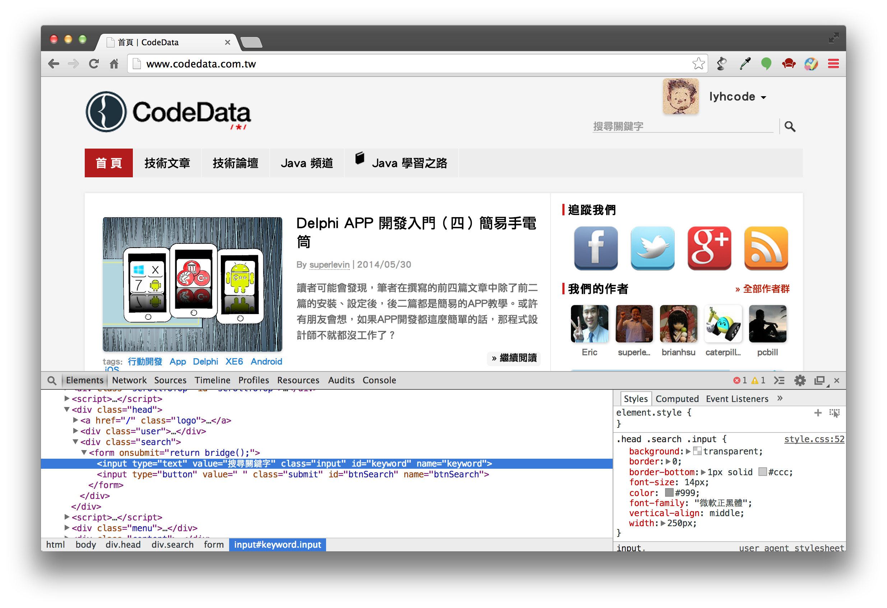
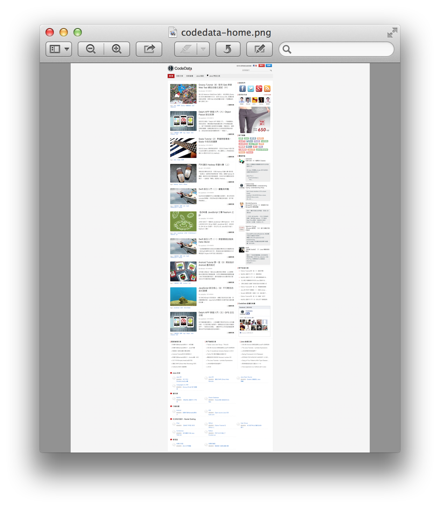

# Groovy Tutorial（8）使用 Geb 開發 Web Test 網站自動化測試（中） #

[Groovy Tutorial（7）使用 Geb 開發 Web Test 網站自動化測試（上） << 前情](http://www.codedata.com.tw/java/groovy-tutorial-7-greb-web-test-part1/)

上一篇已初步介紹 Geb 工具的，對於這套瀏覽器自動化解決方案有興趣的讀者，請再跟著本篇提供的範例，動手開始實作自己的程式。以強大的 Selenium WebDriver 為核心，結合類似 jQuery 的 DOM 選取與操作方式，使用 Groovy DSL 易讀易寫的語法開發，使得 Geb 成為受矚目的新一代瀏覽器自動化測試工具。

## 撰寫 Geb 程式碼 ##

Geb 測試程式本身就是 Groovy 原始碼，使用 Groovy Console 或使用個人喜愛的文字編輯器（如 Sublime Text 或 Vim），即可輕鬆撰寫、執行 Geb 程式，完全不需要依賴特定的編輯工具。

以下是一個最簡易的 Geb 程式碼範例，包含所需的 Grapes 相依套件宣告。在裝有 Groovy 與 Firefox 瀏覽器的電腦上即可直接執行。

範例：`ex01.groovy`

```
@Grapes([
    @Grab('org.gebish:geb-core:0.9.2'),
    @Grab('org.seleniumhq.selenium:selenium-firefox-driver:2.42.0'),
    @Grab('org.seleniumhq.selenium:selenium-support:2.42.0')
])
import geb.Browser

Browser.drive {
    go 'http://www.codedata.com.tw/'
}
```

執行方式：終端機執行指令「`groovy ex01.groovy`」。

## 瀏覽器基本操作指令 ##

`Browser.drive` 開啟一個 DSL 程式區塊，在這個區塊中可以使用 Geb 提供的指令操作瀏覽器。在本節中介紹的瀏覽器操作指令，都必須撰寫在 `drive` 的區塊中。

```
Browser.drive {
    // Geb DSL here!!!
}
```

使用「`go`」命令瀏覽器開啟一個網址，這個範例以 CodeData 網站為例。

```
    go 'http://www.codedata.com.tw/'
```

在開啟一個網頁畫面時，Geb 會等待網頁主要內容都載入完畢，然後才執行下一行指令。為了確保指定的 URL 被正確打開，而且載入的網頁是我們期望的頁面，最基本的檢核就是先比對網頁標題。在 DSL 區塊中使用 title 變數可以取得網頁標題，它是一個字串（String）型態的變數資料。

例如 CodeData 首頁的標題以「CodeData」文字結尾，我們使用字串的 `endsWith` 方法就能檢查載入頁面的標題內容。

```
    println title
    assert title.endsWith('CodeData')
```

如果希望 Geb 的任務完成後，就關閉瀏覽器視窗結束程式，可以使用「`close()`」指令。但是在 Groovy Console 下執行 Geb 程式時，並不建議將瀏覽器視窗關閉，因為這麼做會使得 Selenium WebDriver 無法再次執行任務，需要重新打開 Groovy Console 才能繼續執行 Geb 程式。

```
    close()
```

另一個結束指令為「`quit()`」，它不僅關閉瀏覽器視窗，也會終止 WebDriver 的執行。

```
    quit()
```

對於排程執行或是在終端機下執行的 Geb 程式，需要將瀏覽器視窗關閉，才能讓 Groovy 程式停止執行返回 Shell。

```
Browser.drive {
    go 'http://www.codedata.com.tw/'
    
    // 執行一些自動化操作
    
    close()
}
```

## 使用 Navigator API ##

使用 Geb 命令瀏覽器開啟一個網頁之後，就可以開始對網頁畫面元素（elements）進行存取或控制。例如取得文字內容或填寫、點選表單元件等，這些流程是瀏覽器自動化的常見操作。

我們需要透過瀏覽器選取一個網頁元素，Geb 透過 Navigator API 提供方便的篩選功能，能夠幫助開發者快速準確找到所需要的網頁元素。

以 CodeData 網站為例，以下範例是找出「搜尋關鍵字」這個文字方塊的表單欄位，並填入「groovy」關鍵字，然後點選旁邊的放大鏡按鈕開始搜尋。

要找到特定的網頁元素，我們需要先觀察網頁的 HTML 原始碼。但是只從 Web Server 回應的 HTML 原始資料，經常不足以取得所需的資訊；現代網站很多前端畫面是由 JavaScript 動態產生，DOM 的內容在網頁讀取後還會有所改變，我們可以搭配瀏覽器的除錯工具，例如在 Google Chrome 瀏覽器的網頁中，只要選取右鍵選單的「檢查元素」就能開啟除錯工具（如下圖）。



學會使用網頁除錯工具，是開始撰寫自動化測試程式的第一步。

利用 Navigator API 尋找網頁中特定的元素，通常我們可以利用 HTML 標籤的 id 或 class 屬性，表單欄位也可以用 name 屬性做篩選。

例如 CodeData 網站的搜尋區塊原始碼如下，包含兩個 `<input />` 標籤都是我們需要找到的目標網頁元素。

```
  <div class="search">
    <form onsubmit="return bridge();">
      <input type="text" value="搜尋關鍵字" class="input" id="keyword" name="keyword">
            
      <input type="button" value=" " class="submit" id="btnSearch" name="btnSearch">
    </form>
  </div>
```

以這段 HTML 代碼而言，使用 `id` 來尋找目標元素，是最簡單快速的做法。Navigator API 的基本用法與 jQuery Selector 相當類似，以下是填寫關鍵字並按下搜尋按鈕的範例。

```
$('#keyword').value('groovy')
$('#btnSearch').click()
```

目標元素沒有設定 `id` 屬性也是常遇到的情況，Geb Navigator API 也可以利用 `class` 屬性選取元素。相同功能的程式碼改寫如下：

```
$('div.search .input').value('groovy')
$('div.search .submit').click()
```

也可以使用目標元素的某個屬性（attribute）做選取，例如表單元件很適合以 `name` 屬性值篩選。

```
$('input', name: 'keyword').value('groovy')
$('input', name: 'btnSearch').click()
```

使用 `class` 屬性可以找到符合篩選條件的多筆目標元素，如果要知道共找到幾個元素，只要使用 `size()` 方法即可取得數量值。

```
println $('.list .block h3 a').size()
```

搭配 Groovy 的 `each` 方法，可以對找到的多筆網頁元素進行存取控制。以下程式碼示範將搜尋結果中每一篇文章的標題印出。

```
$('.list .block h3 a').each { elem ->
  println elem.text()
}
```

以下是 CodeData 網站搜尋功能自動化操作的完整範例程式碼。

```
@Grapes([
    @Grab('org.gebish:geb-core:0.9.2'),
    @Grab('org.seleniumhq.selenium:selenium-firefox-driver:2.42.0'),
    @Grab('org.seleniumhq.selenium:selenium-support:2.42.0')
])
import geb.Browser

Browser.drive {
    go 'http://www.codedata.com.tw/'

    $('input', name: 'keyword').value('groovy')
    $('input', name: 'btnSearch').click()

    $('.list .block h3 a').each { elem ->
        println elem.text()
    }
}
```

## 使用 waitFor 指令 ##

許多網站使用前端 JavaScript 技術強化網頁瀏覽效果，特別是使用 AJAX 技術或 SPA（Single-page application）架構的網站，在進行自動化測試時，需要先等待網頁的背景動作完成。例如點選送出指令後，透過 AJAX 更新某些內容，Geb 提供 `waitFor` 指令方便此類型的測試需求。

以 Google reCAPTCHA 的 AJAX Demo 為例，按下「Click Me」按鈕後，會利用 AJAX 載入 Captcha （圖片驗證碼）的區塊，我們可以利用 `waitFor` 指令等待 JavaScript 建立此區塊的 DOM 之後，再抓取驗證圖片的來源位址。

```
Browser.drive {
    go 'https://www.google.com/recaptcha/demo/ajax'

    $('input', value: 'Click Me').click()

    waitFor {
        $('#recaptcha_area').size() > 0
    }

    println $('#recaptcha_challenge_image').attr('src')
}
```

在 `waitFor` 的區塊中使用條件判斷式，執行程序會一直等待判斷結果成立才繼續。

* `$("div#result").text() == "Successful"`
* `$("img.thumbnail").size() >= 20`

如果想改變 `waitFor` 等待的時間長度，以及每次測試判斷條件是否成立的時間間隔，可以利用傳入的參數改變預設值。

```
waitFor(10) {}        // 最長等待時間為 10 秒
waitFor(10, 0.5) {}   // 每次判斷條件的間隔時間為 0.5 秒
```

## 擷取測試結果 ##

自動化測試的每個步驟完成或失敗發生後，我們可以利用 Geb 的報表功能擷取測試結果，包含網頁畫面截圖與當前 HTML 原始碼。使用 `config.reportsDir` 可以自訂檔案存放的路徑，以下是將 CodeData 首頁截圖的範例。

```
Browser.drive {
    config.reportsDir = new File('/tmp')

    go 'http://www.codedata.com.tw/'

    report 'codedata-home'
}
```

`report` 指令的參數是測試報告的名稱，圖片及原始碼檔案會依此命名，在指定的存放路徑下產生 .png 及 .html 檔案。

* /tmp/codedata-home.html
* /tmp/codedata-home.png

以下是瀏覽器網頁畫面截圖的範例，對自動化測試的任務，保留各階段測試的畫面，可以彙整成一份更詳盡的測試報告。如果要撰寫一個 Web Screen Capture 的程式，使用 Geb 也可以輕鬆完成。




