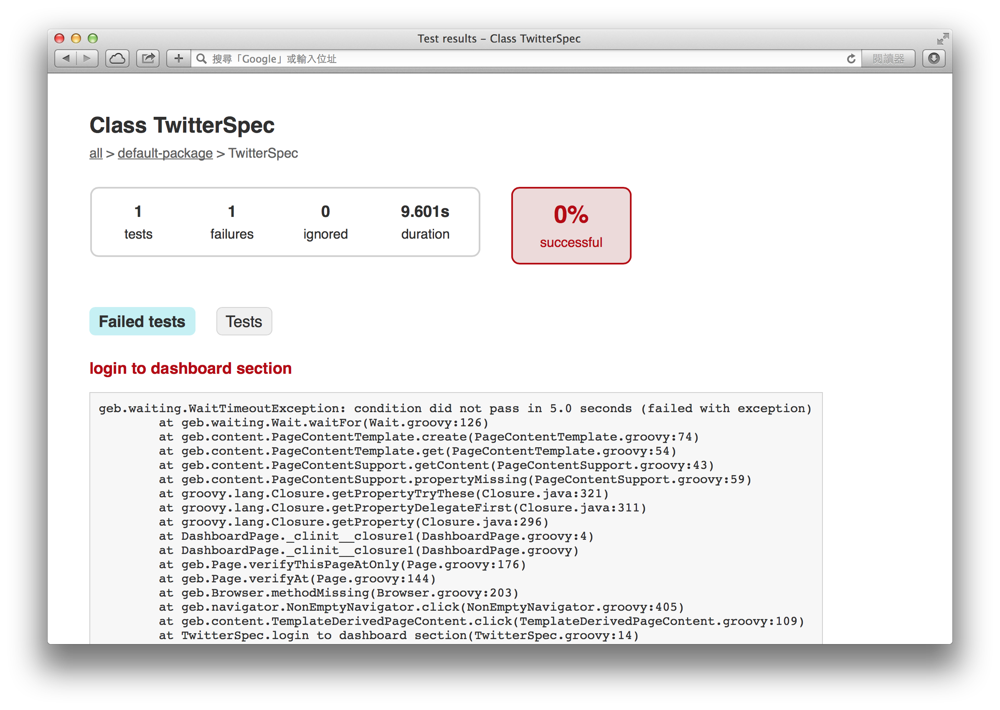

# Groovy Tutorial（9）使用 Geb 開發 Web Test 網站自動化測試（下） #

[Groovy Tutorial（8）使用 Geb 開發 Web Test 網站自動化測試（中） << 前情](http://www.codedata.com.tw/java/groovy-tutorial-8-greb-web-test-part2/)

我們希望讀者在閱讀完本系列的文章後，就有足夠的基礎知識可以開始動手寫 Geb 測試程式。三篇介紹並不足以涵蓋所有 Geb 與 Selenium 的開發細節，僅能挑選重點、入門常見的問題

作為 Geb 系列的最後一篇教學，WebDriver 以支援不同的瀏覽器，以及使用 Page Object 讓自動化測試代碼更容易被重複使用，最後在探討與 Java 測試框架的整合方式。希望讀者在看過本系列的三篇介紹後，能夠開始動手利用 Geb 完成一些 Web 專案的測試任務，從中體驗 Groovy 能讓工作更輕鬆完成的樂趣。

## 跨瀏覽器測試支援 ##

測試網站在不同瀏覽器執行的相容度，也是許多軟體專案測試的常見需求，Geb 使用 Selenium WebDriver 為基礎，所以 Selenium 支援的瀏覽器類型，就可以在 Geb 程式中使用。使用 MVNRepository.com 查詢 [org.seleniumhq.selenium](http://mvnrepository.com/artifact/org.seleniumhq.selenium) 群組，可以看到 Selenium 已經提供的 WebDriver 套件，以下是目前已經發佈的 WebDriver 專案名稱：

* selenium-chrome-driver
* selenium-firefox-driver
* selenium-ie-driver
* selenium-safari-driver 
* selenium-htmlunit-driver

Selenium 早期就是搭配 Firefox 瀏覽器發展，所以在 Geb 預設也是使用 FirefoxDriver 的設定，只要電腦中已安裝 Firefox 瀏覽器，並不需要加掛其它軟體。如果沒有特別指定瀏覽器的需求，使用 FirefoxChrome 是最簡單的方式，不必多做額外的設定。

在 Geb 程式中自訂 WebDriver 很容易，只要設定「`driver`」即可指定瀏覽器類型。

* `driver = 'firefox'`
* `driver = new FirefoxDriver()`

以上兩種設定方式都可以被 Geb 接受，但是使用「`new FirefoxDriver()`」必須先引入（import）指定的類別，否則會顯示無法找到類別（ClassNotFoundException）。

## HtmlUnit Driver ##

首先要介紹的是 WebDriver 是 HtmlUnitDriver，如果在沒有 GUI 環境的 Server 上執行 Geb 測試程式，就無法使用一般網頁瀏覽器，HtmlUnit 是 Java 平台用於滿足瀏覽器測試需求的函式庫，它可以在沒有 GUI 環境的 console 中執行，支援許多瀏覽器行為操作的模擬，包含一些使用 JavaScript 的 AJAX 互動網頁。

若要將 WebDriver 切換為 HtmlUnitDriver，需要先使用 `@Grab` 配置相依的套件再作 `driver` 的設定。 

```
@Grapes([
    @Grab('org.gebish:geb-core:0.9.3'),
    @Grab('org.seleniumhq.selenium:selenium-htmlunit-driver:2.42.0'),
    @Grab('org.seleniumhq.selenium:selenium-support:2.42.0')
])
import geb.Browser

driver = 'htmlunit'

Browser.drive {
    go 'http://www.codedata.com.tw/'
    println title
}
```

另一種設定 `driver` 的方式。

```
import org.openqa.selenium.htmlunit.HtmlUnitDriver
driver = new HtmlUnitDriver()
```

## Chrome Driver ##

使用 Geb 搭配其他瀏覽器時，需要先配置所需的執行環境，以 Google Chrome 瀏覽器為例，必須先下載安裝 ChromeDriver 並配置 `webdriver.chrome.driver` 系統環境變數。

先下載最新版本的 [ChromeDriver](http://chromedriver.storage.googleapis.com/index.html) 檔案，目前提供的作業系統支援包含 Linux（32 及 64 位元）、Mac(32 位元) 及 Windows（32 位元）。

* chromedriver_linux32.zip
* chromedriver_linux64.zip
* chromedriver_mac32.zip
* chromedriver_win32.zip

將下載的 `chromedriver*.zip` 檔案解壓縮到特定的資料夾，並配置 `webdriver.chrome.driver` 系統環境變數，其設定值為 chromedriver（或 chromedriver.exe）的完整路徑。若不想變更作業系統設定，在 Geb 程式中也可以使用 `System.setProperty(...)` 修改設定。

以下是 Geb 搭配 Chrome 瀏覽器的程式範例。

```
@Grapes([
    @Grab('org.gebish:geb-core:0.9.3'),
    @Grab('org.seleniumhq.selenium:selenium-chrome-driver:2.42.0'),
    @Grab('org.seleniumhq.selenium:selenium-support:2.42.0')
])
import geb.Browser
import org.openqa.selenium.chrome.ChromeDriver

System.setProperty('webdriver.chrome.driver', '/tmp/chromedriver')

driver = {
   new ChromeDriver()
}

Browser.drive {
    go 'http://www.codedata.com.tw/'
    println title
}
```

## 定義 Page 物件 ##

學會使用 Geb 提供的 Page 物件，就可以發現 Geb 不僅讓 Selenium WebDriver 的操作更簡易，它還可以讓我們針對一個網站應用程式，撰寫更容易重複使用的測試元件。舉例來說，有一個 Web 系統包含 Login 與 Dashboard 兩個頁面，必須先在 Login 頁面填寫使用者帳號密碼，通過驗證後才能進到 Dashboard 頁面。如果有很多測試功能，都需要先進行 Login 的操作，我們就可以利用繼承 `Page` 物件來實作該頁面專屬的測試功能。

以下是 `Page` 物件定義的範例，在 `content` 區塊中，我們將該網頁內容需要被自動化操作的 DOM 元件，先透過 Navigator API 找到，就能夠方便在測試程式中使用。

* LoginPage.groovy

```
import geb.Page
     
class LoginPage extends Page {
    static url = "http://localhost:8080/user/login"
    static at = { heading.text() == "Login Form" }
    static content = {
        heading { $("h1.page-title") }
        loginForm { $("form.login-form") }
        loginButton(to: DashboardPage) { $("button.submit") }
    }
}
```

* DashboardPage.groovy

```
import geb.Page

class DashboardPage extends Page {
    static at = { heading.text() == "My Dashboard" }
    static content = {
        heading { $("h1") }
    }
}
```

在操作 `Page` 物件時，可以搭配 `to` 與 `at` 兩個指令使用。

* 使用 `to` 開啟 `Page` 物件所在的 URL 位址。
* 使用 `at` 判斷是否為在該 `Page` 所屬頁面。

`Page` 物件讓 Geb 測試程式呈現更有趣的 DSL 風格。

```
import geb.Browser

Browser.drive {
    to LoginPage
    assert at(LoginPage)
    loginForm.with {
        username = "admin"
        password = "password"
    }
    loginButton.click()
    assert at(DashboardPage)
}
```

定義好的 Page 物件可以被重複使用，依照測試案例（test case）的需求，組合成不同的測試執行流程。對於中大型的 Web Application 自動化測試，Geb 的 Page 物件讓測試程式的維護更容易。

## 搭配單元測試框架 ##

使用 Geb 撰寫的測試程式，可以作為專案自動化功能測試（functional test）的項目，搭配 IDE 開發工具或 Jenkins CI 持續整合，讓瀏覽器自動化測試的結果，與其它單元測試項目一併被執行與產生測試報告。Geb 可以和常見的 Java 測試框架搭配使用，例如：

* Spock
* JUnit
* TestNG

以下是搭配 Spock 測試框架的測試程式範例。

```
import geb.Page
import geb.spock.GebSpec
 
class LoginSpec extends GebSpec {
    def "login to dashboard section"() {
        given:
        to LoginPage
         
        when:
        loginForm.with {
            username = "admin"
            password = "password"
        }
         
        and:
        loginButton.click()
         
        then:
        at DashboardPage
    }
}
```

在搭配 Spock 框架使用時，需要額外的 [geb-spock](http://mvnrepository.com/artifact/org.gebish/geb-spock) 套件。

    @Grab('org.gebish:geb-spock:0.9.3')

## Gradle、Spock、Geb 測試流程整合 ##

簡易的 Geb 測試程式只要用 Groovy Script 方式撰寫，但是對一個完整的 Web 專案測試而言，上百甚至上千行的 Script 程式碼，將會讓測試程式變得難以維護。在實務上我們必須搭配自動化專案建置工具與測試框架，讓 Geb 的測試程式也能為專案建置的一部份。

在實務經驗上可行的開發工具組合建議是：

* 搭配 Gradle 專案自動化建置
* 使用 Geb Page Objects 定義每個需要被測試的頁面
* 利用 Spock 或 JUnit 撰寫單元測試案例

我們以 Gradle 建置工具示範 Geb + Spock 的測試流程整合，以下是所需要的 `build.gradle` 設定範例。

```
apply plugin: 'groovy'

repositories {
    mavenCentral()
}

dependencies {
    groovy "org.codehaus.groovy:groovy-all:2.3.3"


    // spock-core
    testCompile "org.spockframework:spock-core:0.7-groovy-2.0"

    // geb, geb-spock
    testCompile "org.gebish:geb-core:0.9.3"
    testCompile "org.gebish:geb-spock:0.9.3"
    testCompile "org.seleniumhq.selenium:selenium-firefox-driver:2.42.0"
    testCompile "org.seleniumhq.selenium:selenium-support:2.42.0"
}
```

分別定義兩個 Page 物件，分別對應 Twitter 登入表單與主畫面。

範例：`src/test/groovy/LoginPage.groovy`（登入表單）

```
import geb.Page

class LoginPage extends Page {
    static url = "https://twitter.com/login"
    static at = { heading.text() == "登入 Twitter" }
    static content = {
        heading { $("h1") }
        loginForm { $("form.signin") }
        loginButton(to: DashboardPage) { $("button.submit") }
    }
}
```

範例：`src/test/groovy/DashboardPage.groovy`（主畫面）

```
import geb.Page

class DashboardPage extends Page {
    static at = { heading.text() == "推文" }
    static content = {
        heading(wait: true) { $("h2#content-main-heading") }
    }
}
```

使用 Spock 定義一個測試案例，驗證輸入正確的帳號密碼後顯示主畫面。

範例：`src/test/groovy/TwitterSpec.groovy`

```
import geb.Page
import geb.spock.GebSpec

class TwitterSpec extends GebSpec {
    def "login to dashboard section"() {
        given:
        to LoginPage

        when:
        $('input.js-username-field').value("username")
        $('input.js-password-field').value("password")

        and:
        loginButton.click()

        then:
        at DashboardPage
    }
}
```

執行 Gradle 的 test 任務時，就會執行 Geb 測試程式。

```
gradle test
```

測試結果也會整合在輸出報表。



整合到專案自動化建置的 Geb 測試程式，會成為專案自動化測試流程的一部份，在使用 Jenkins CI 持續整合時，也順帶完成瀏覽器自動化測試。

請參考本文附錄的[完整程式碼](https://github.com/lyhcode/GroovyTutorial/tree/master/src/09_GebWebTest/gradle-spock-geb)。

## 參考資源 ##

* [The Book of Geb](http://www.gebish.org/manual/current/)
* [Taming Functional Web Testing with Spock and Geb](http://www.infoq.com/presentations/testing-spock-geb) ([slides](http://qconlondon.com/dl/qcon-london-2013/slides/PeterNiederwieser_TamingFunctionalWebTestingWithSpockAndGeb.pdf))